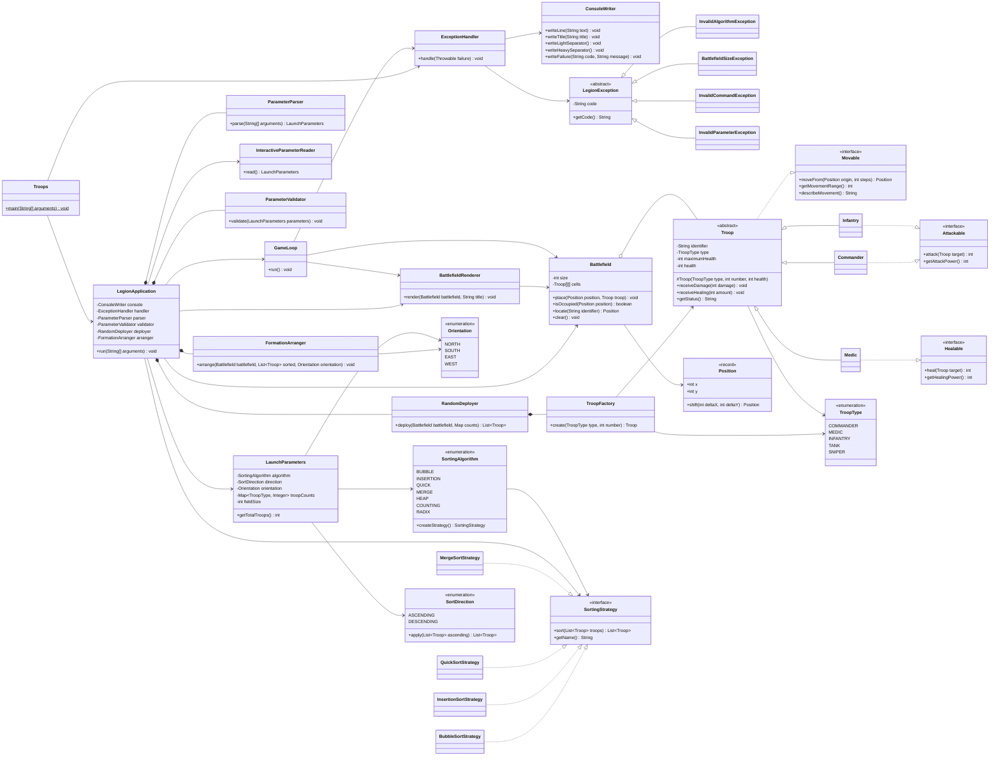
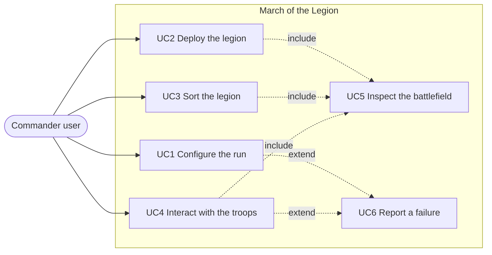

# March of the Legion

Console strategy simulator written in **Java 17**. The project is compiled with `javac` using the `build.sh` and `run.sh` scripts included in the root directory.

The program receives a configuration (sorting algorithm, sort direction, formation orientation, troop amounts, and field size), deploys the legion in random collision-free positions on a square matrix, sorts the units by their health points using the chosen algorithm, reorganizes the battlefield leaving one troop type per line, and finally hands control over to an interactive session where the user commands the units by entering commands.
---

## How to Run

```bash
chmod +x build.sh run.sh

./build.sh
```

CLI Mode:

```bash
./run.sh a=b t=c o=s u=1,1,2 f=6
```

Interactive Mode (without arguments, the program prompts for each value):

```bash
./run.sh
```

Equivalent execution without scripts:

```bash
javac -d out $(find src -name "*.java")
java -cp out legion.Troops a=i t=d o=e u=2,1,3
```

---

## Parameter Table

| Parameter | Meaning | Values | Required |
|---|---|---|---|
| `a` | Sorting algorithm | `b` bubble, `i` insertion (implemented); `q`, `m`, `h`, `c`, `r` declared as stubs | Yes |
| `t` | Sort direction | `c` ascending, `d` descending | Yes |
| `o` | Final formation orientation | `n` north, `s` south, `e` east, `w` west | Yes |
| `u` | Unit counts by type, in the order `commander,medic,infantry` | Comma-separated integers, for example `1,1,2` | Yes |
| `f` | Side length of the square matrix | Integer between 2 and 1000 | No, defaults to `6` |

Sorting is always calculated based on unit health points. Orientation determines whether sorted groups are stacked in rows (`n`, `s`) or columns (`w`, `e`) and from which border the formation expands.

---

## Technical Justification

### Why Inheritance?

`Troop` is an abstract class that consolidates everything identical across all units: identifier, type, current health, maximum health, receiving damage and healing, and constructing status lines. `Commander`, `Medic`, and `Infantry` inherit state and behavior instead of duplicating code. Inheritance models an *is-a* relationship: a medic **is** a troop and can substitute for `Troop` anywhere in the application without breaking functionality, fulfilling the Liskov substitution principle. Furthermore, inheritance enables the battlefield matrix to be stored as `Troop[][]`, allowing the renderer, sorter, and command loop to operate against abstractions without querying concrete classes.

### Why Composition?

Classes that collaborate permanently and cannot exist independently are composed. `LegionApplication` **has** a `ParameterParser`, `ParameterValidator`, `RandomDeployer`, and `FormationArranger`. These objects share their lifecycle with the application and are not referenced elsewhere. Similarly, `RandomDeployer` composes `TroopFactory` because deployment requires unit instantiation. Composition was preferred over inheritance in these cases because the relationship is *has-a*, not *is-a*: `LegionApplication` is not a parser, it uses one. This approach keeps coupling low so modifying a parser does not alter class hierarchies.

### Why Aggregation?

`Battlefield` aggregates troops: the matrix contains and positions them, but does not own their lifecycle. Units are created by `TroopFactory`, stored in the list returned by `RandomDeployer`, processed through the sorting algorithm, and relocated on the matrix by `FormationArranger`. Clearing the battlefield grid with `clear()` leaves the troops intact in the sorted list. Therefore, the relationship is aggregation rather than composition: it represents a *uses and contains during execution* relationship rather than strict ownership.

### Why Interfaces?

Not all troops share identical actions, and placing `attack()` and `heal()` methods in the abstract base class would force units to inherit irrelevant methods. Decoupling `Movable`, `Attackable`, and `Healable` applies the Interface Segregation Principle: `Medic` implements `Healable` without receiving empty `attack()` implementations or throwing runtime exceptions, while `Infantry` implements `Attackable` without carrying healing logic. Interfaces also preserve Dependency Inversion in sorting: `LegionApplication` depends on `SortingStrategy` rather than `BubbleSortStrategy`, ensuring new algorithms can be introduced without modifying the orchestrator.

### Why Behavior Injection?

Abilities are declared on a per-unit basis rather than defined in the root class hierarchy. `Troop` only implements `Movable`, which is universal across all units. Attack and heal behaviors are injected into relevant subclasses. In `GameLoop`, before executing `attack` or `heal`, the system checks contract compatibility (`actor instanceof Attackable`) rather than checking concrete classes. When future units like `Tank`, `Sniper`, or an engineering unit enter in subsequent updates, the command loop code remains unchanged as long as new units declare their implemented interfaces.

---

## Applied Design Patterns

### Factory: `TroopFactory`

**Problem Solved:** Prevents direct `new` calls for concrete units from scattering across the codebase. If deployment instantiated `new Commander(...)` directly, any constructor modification or new unit type would require editing multiple files.

```java
public Troop create(TroopType type, int number) {
    return switch (type) {
        case COMMANDER -> new Commander(number, varyHealth(COMMANDER_BASE_HEALTH));
        case MEDIC -> new Medic(number, varyHealth(MEDIC_BASE_HEALTH));
        case INFANTRY -> new Infantry(number, varyHealth(INFANTRY_BASE_HEALTH));
        case TANK -> throw new IllegalArgumentException(TroopType.TANK.getLabel() + NOT_IMPLEMENTED);
        case SNIPER -> throw new IllegalArgumentException(TroopType.SNIPER.getLabel() + NOT_IMPLEMENTED);
    };
}
```

Pending unit types are already declared in the enum and handled in the `switch` statement, documenting the roadmap while deferring implementation details.

### Strategy: `SortingStrategy`

**Problem Solved:** Allows switching sorting algorithms at runtime based on parameter `a` without spreading conditional logic throughout the application.

```java
public interface SortingStrategy {
    List<Troop> sort(List<Troop> troops);
    String getName();
}
```

The `SortingAlgorithm` enum serves as the registry mapping console keys to concrete strategies:

```java
BUBBLE("b", BubbleSortStrategy::new, true),
INSERTION("i", InsertionSortStrategy::new, true),
QUICK("q", QuickSortStrategy::new, false),
MERGE("m", MergeSortStrategy::new, false);
```

Adding an algorithm requires implementing the interface and registering an entry in the enum, leaving existing code intact (Open/Closed Principle).

---

## Class Diagram

Source file: [`docs/diagrams/class-diagram.mmd`](docs/diagrams/class-diagram.mmd)



---

## Use Case Diagram

Source file: [`docs/diagrams/use-case-diagram.mmd`](docs/diagrams/use-case-diagram.mmd)



---

## Use Cases

| # | Use Case | Input | Expected Output |
|---|---|---|---|
| UC1 | Configure execution via CLI | `./run.sh a=b t=c o=s u=1,1,2 f=6` | `CONFIGURATION` block showing algorithm, direction, orientation, field size, and total troops |
| UC2 | Configure execution via menu | `./run.sh` without arguments | Interactive prompts asking for algorithm, direction, orientation, counts, and field size, producing valid configuration |
| UC3 | Deploy the legion | Valid configuration | `INITIAL DEPLOYMENT` map displaying troops in random collision-free cells with a symbol legend |
| UC4 | Sort the legion | `a=b t=c` | `SORTING REPORT` block showing strategy, direction, elapsed time in nanoseconds, and sorted HP list |
| UC5 | Form sorted legion | `o=s` | `FINAL FORMATION` map placing one troop type per line, expanding from the selected border |
| UC6 | Interact with troops | `move I-1 2`, `status`, `help`, `exit` | Unit moves according to its pattern, state redraws, and session terminates cleanly |
| UC7 | Report configuration error | `./run.sh a=b t=c o=s u=1,1,20 f=6` | `ERROR E-FIELD` block detailing capacity limits with controlled exit |

---

## Error Handling

Design: `LegionException` serves as the common base exception. There is **a single `try/catch` in `Troops.main`** and another in `GameLoop` so invalid commands do not terminate active sessions. Both delegate to `ExceptionHandler`, which serves as the sole reporting channel.

```bash
grep -rn "catch" src/ | wc -l   # 2
```

| Code | Exception | Trigger Condition | Example Message |
|---|---|---|---|
| `E-ALG` | `InvalidAlgorithmException` | Non-existent algorithm key or stub algorithm selected | `Sorting algorithm q is planned for the second milestone. Available now: b, i` |
| `E-FIELD` | `BattlefieldSizeException` | Field size out of bounds, troop count exceeding capacity, or position outside matrix | `A line holds 6 units and 20 Infantry were requested.` |
| `E-CMD` | `InvalidCommandException` | Unknown command, missing arguments, occupied destination, or unit lacking ability | `M-1 cannot attack.` |
| `E-PARAM` | `InvalidParameterException` | Malformed `key=value` pair, missing required parameter, or non-numeric value | `Malformed parameter: a. Expected key=value.` |
| `E-UNEXPECTED` | Any unhandled `RuntimeException` | Unexpected domain exception | `Unexpected failure. The operation was cancelled.` |

---

## Milestone Status

### Implemented and Working

- [x] Java project `legion` compilable with `javac` via `build.sh`.
- [x] Key-value CLI parameter parsing and interactive mode with `Scanner`.
- [x] Validation for algorithm, direction, orientation, troop counts, and field capacity.
- [x] OOP hierarchy: abstract `Troop`, `private` attributes, `protected` constructor, three concrete units.
- [x] Behavioral interfaces (`Movable`, `Attackable`, `Healable`) injected per unit type.
- [x] Factory pattern (`TroopFactory`) and Strategy pattern (`SortingStrategy` + `SortingAlgorithm`).
- [x] Configurable battlefield matrix, random deployment without collisions, and map rendering with legend.
- [x] Bubble Sort and Insertion Sort implemented, with execution timing measured via `System.nanoTime()`.
- [x] Final formation layout holding one troop type per line supporting four orientations.
- [x] Centralized exception handling with custom exception hierarchy and codes.
- [x] `GameLoop` supporting `move`, `attack`, `heal`, `status`, `help`, and `exit`.
- [x] Class diagram and use case diagram created in Mermaid.

### Declared as Stubs for Milestone 2

- [ ] `QuickSortStrategy`, `MergeSortStrategy`, `HeapSortStrategy`, `CountingSortStrategy`, `RadixSortStrategy`: classes declared and registered in enum, `sort()` throws `UnsupportedOperationException`.
- [ ] Unit types `TANK` and `SNIPER`: present in `TroopType`, explicitly rejected in `TroopFactory`.
- [ ] `attack` and `heal` in `GameLoop` validate interface capabilities while printing simulated actions.
- [ ] Performance benchmarks comparing sorting algorithms.
- [ ] Turn system, factions, and AI behavior.
- [ ] Command pattern with dynamic registration and fuzzy command matching.
- [ ] Logging channel writing to `error.log`.

---

## Execution Logs (15 Executions)

The following section documents 15 actual executions of the system covering successful workflows with various configurations (algorithms, directions, orientations, dimensions, and modes) as well as error handling verification.

### 1. Ascending Bubble Sort: South Orientation (6x6 Matrix)
**Command:** `./run.sh a=b t=c o=s u=1,1,2 f=6`
**Result:** Random deployment, Bubble Sort sorting by HP in ascending order (`M-1`, `I-2`, `I-1`, `C-1`), and row placement starting from the south border.

```text
==============================================================
CONFIGURATION
==============================================================
Algorithm: Bubble Sort
Order: ascending
Orientation: south
Field: 6x6
Troops: 4
==============================================================
SORTING REPORT
==============================================================
Strategy: Bubble Sort
Direction: ascending
Elapsed: 94417 ns (0.094417 ms)
Result: [M-1(128), I-2(166), I-1(176), C-1(193)]
==============================================================
FINAL FORMATION
==============================================================
* * * * * *
* * * * * *
* * * * * *
C * * * * *
I I * * * *
M * * * * *
==============================================================
```

---

### 2. Descending Insertion Sort: North Orientation (8x8 Matrix)
**Command:** `./run.sh a=i t=d o=n u=2,2,4 f=8`
**Result:** Insertion Sort sorting 8 units by HP in descending order (`C-1`, `C-2`, `I-1`, `I-2`, `M-2`, `I-3`, `I-4`, `M-1`), placed starting from the north border.

```text
==============================================================
CONFIGURATION
==============================================================
Algorithm: Insertion Sort
Order: descending
Orientation: north
Field: 8x8
Troops: 8
==============================================================
SORTING REPORT
==============================================================
Strategy: Insertion Sort
Direction: descending
Elapsed: 268154 ns (0.268154 ms)
Result: [C-1(200), C-2(185), I-1(176), I-2(154), M-2(147), I-3(145), I-4(142), M-1(142)]
==============================================================
FINAL FORMATION
==============================================================
C C * * * * * *
I I I I * * * *
M M * * * * * *
* * * * * * * *
* * * * * * * *
* * * * * * * *
* * * * * * * *
* * * * * * * *
==============================================================
```

---

### 3. Ascending Bubble Sort: East Orientation (5x5 Matrix)
**Command:** `./run.sh a=b t=c o=e u=1,2,3 f=5`
**Result:** Vertical column alignment anchored against the east border of the battlefield.

```text
==============================================================
CONFIGURATION
==============================================================
Algorithm: Bubble Sort
Order: ascending
Orientation: east
Field: 5x5
Troops: 6
==============================================================
SORTING REPORT
==============================================================
Strategy: Bubble Sort
Direction: ascending
Elapsed: 77410 ns (0.07741 ms)
Result: [M-1(123), M-2(124), I-2(150), I-3(164), I-1(179), C-1(209)]
==============================================================
FINAL FORMATION
==============================================================
* * C I M
* * * I M
* * * I *
* * * * *
* * * * *
==============================================================
```

---

### 4. Descending Insertion Sort: West Orientation (6x6 Matrix)
**Command:** `./run.sh a=i t=d o=w u=2,1,2 f=6`
**Result:** Vertical column alignment anchored against the west border of the battlefield.

```text
==============================================================
CONFIGURATION
==============================================================
Algorithm: Insertion Sort
Order: descending
Orientation: west
Field: 6x6
Troops: 5
==============================================================
SORTING REPORT
==============================================================
Strategy: Insertion Sort
Direction: descending
Elapsed: 128697 ns (0.128697 ms)
Result: [C-2(193), C-1(180), I-1(177), M-1(149), I-2(142)]
==============================================================
FINAL FORMATION
==============================================================
C I M * * *
C I * * * *
* * * * * *
* * * * * *
* * * * * *
* * * * * *
==============================================================
```

---

### 5. Interactive REPL Session (`GameLoop` Commands)
**Command:** `./run.sh a=b t=c o=s u=1,1,2 f=6`
**Input Commands:** `status`, `move I-1 2`, `attack I-1 C-1`, `heal M-1 I-1`, `exit`
**Result:** Interactive command execution with map redrawing, boundary checking, and ability invocation.

```text
legion> status
==============================================================
BATTLEFIELD
==============================================================
C-1 Commander health=207/207 range=3 pattern=diagonal
I-2 Infantry health=158/158 range=2 pattern=straight
I-1 Infantry health=165/165 range=2 pattern=straight
M-1 Medic health=132/132 range=1 pattern=lateral
--------------------------------------------------------------
legion> move I-1 2
ERROR E-CMD: Destination (1, 6) is outside the battlefield.
legion> attack I-1 C-1
Action executed: I-1 attacks C-1
legion> heal M-1 I-1
Action executed: M-1 heals I-1
legion> exit
Session closed.
```

---

### 6. Error E-ALG: Unknown Algorithm Key
**Command:** `./run.sh a=z t=c o=s u=1,1,2 f=6`
**Result:** Centralized exception handling via `ExceptionHandler` with code `E-ALG`.

```text
==============================================================
ERROR E-ALG
Unknown sorting algorithm: z
==============================================================
```

---

### 7. Error E-ALG: Stub Algorithm Planned for Milestone 2
**Command:** `./run.sh a=q t=c o=s u=1,1,2 f=6`
**Result:** Controlled rejection of the QuickSort stub (`a=q`).

```text
==============================================================
ERROR E-ALG
Sorting algorithm q is planned for the second milestone. Available now: b, i
==============================================================
```

---

### 8. Error E-PARAM: Invalid Sort Direction
**Command:** `./run.sh a=b t=x o=s u=1,1,2 f=6`
**Result:** Rejection of invalid value for sort direction.

```text
==============================================================
ERROR E-PARAM
Unknown sort direction: x. Expected c or d.
==============================================================
```

---

### 9. Error E-PARAM: Invalid Orientation
**Command:** `./run.sh a=b t=c o=z u=1,1,2 f=6`
**Result:** Rejection of invalid value for formation orientation.

```text
==============================================================
ERROR E-PARAM
Unknown orientation: z. Expected n, s, e or w.
==============================================================
```

---

### 10. Error E-PARAM: Malformed Parameter Syntax
**Command:** `./run.sh invalid_arg_string`
**Result:** Detection of invalid argument missing `key=value` format.

```text
==============================================================
ERROR E-PARAM
Malformed parameter: invalid_arg_string. Expected key=value.
==============================================================
```

---

### 11. Error E-FIELD: Field Size Below Minimum Limit (`f=1`)
**Command:** `./run.sh a=b t=c o=s u=1,1,2 f=1`
**Result:** Validation enforcing minimum field size (`f >= 2`).

```text
==============================================================
ERROR E-FIELD
Field size must be between 2 and 1000, received 1.
==============================================================
```

---

### 12. Error E-FIELD: Field Size Above Maximum Limit (`f=1500`)
**Command:** `./run.sh a=b t=c o=s u=1,1,2 f=1500`
**Result:** Validation enforcing maximum field size (`f <= 1000`).

```text
==============================================================
ERROR E-FIELD
Field size must be between 2 and 1000, received 1500.
==============================================================
```

---

### 13. Error E-FIELD: Line Capacity Overflow (`u=1,1,10` on 6x6 Matrix)
**Command:** `./run.sh a=b t=c o=s u=1,1,10 f=6`
**Result:** Rejection when requested count for a troop category exceeds row/column cell count.

```text
==============================================================
ERROR E-FIELD
A line holds 6 units and 10 Infantry were requested.
==============================================================
```

---

### 14. Interactive Setup Mode (Interactive Parameter Reader)
**Command:** `./run.sh` *(without CLI arguments, prompts answered via console)*
**Result:** Step-by-step parameter input via `InteractiveParameterReader` and `Scanner`.

```text
==============================================================
INTERACTIVE SETUP
==============================================================
Sorting algorithm (b=bubble, i=insertion): b
Order (c=ascending, d=descending): c
Orientation (n, s, e, w): n
Amount of Commander: 1
Amount of Medic: 1
Amount of Infantry: 2
Field size (empty for 6): 6
==============================================================
CONFIGURATION
==============================================================
Algorithm: Bubble Sort
Order: ascending
Orientation: north
Field: 6x6
Troops: 4
==============================================================
```

---

### 15. Minimal Matrix Execution (3x3 Grid with 1 Unit per Type)
**Command:** `./run.sh a=i t=c o=s u=1,1,1 f=3`
**Result:** Execution verification on minimum allowed grid size `3x3`.

```text
==============================================================
CONFIGURATION
==============================================================
Algorithm: Insertion Sort
Order: ascending
Orientation: south
Field: 3x3
Troops: 3
==============================================================
FINAL FORMATION
==============================================================
C * *
I * *
M * *
==============================================================
```

---

## Project Structure

```
legion/
├── build.sh
├── run.sh
├── README.md
├── README_EN.md
├── docs/diagrams/
│   ├── class-diagram.mmd
│   └── use-case-diagram.mmd
└── src/legion/
    ├── Troops.java
    ├── LegionApplication.java
    ├── console/ConsoleWriter.java
    ├── errors/
    │   ├── LegionException.java
    │   ├── ExceptionHandler.java
    │   └── types/
    ├── setup/
    │   ├── LaunchParameters.java
    │   ├── ParameterParser.java
    │   ├── InteractiveParameterReader.java
    │   └── ParameterValidator.java
    ├── troops/
    │   ├── Troop.java
    │   ├── TroopType.java
    │   ├── TroopFactory.java
    │   ├── abilities/
    │   └── units/
    ├── battlefield/
    │   ├── Battlefield.java
    │   ├── Position.java
    │   ├── Orientation.java
    │   ├── BattlefieldRenderer.java
    │   ├── RandomDeployer.java
    │   └── FormationArranger.java
    ├── sorting/
    │   ├── SortingStrategy.java
    │   ├── SortingAlgorithm.java
    │   ├── SortDirection.java
    │   └── strategies/
    └── commands/GameLoop.java
```
