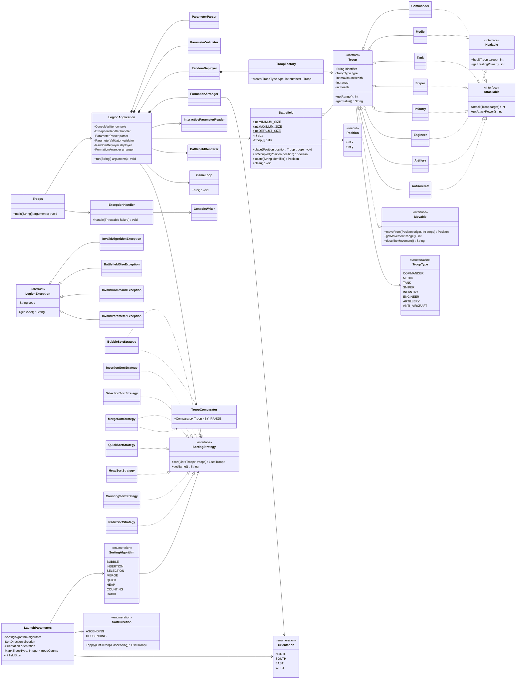
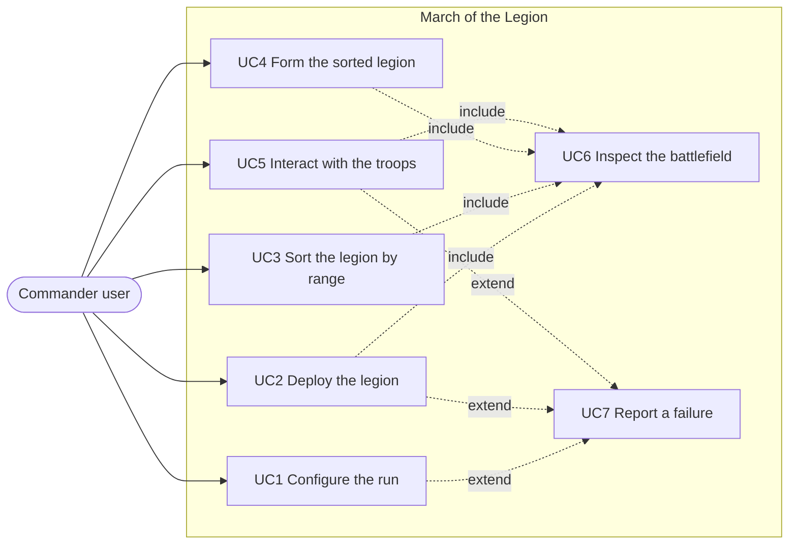
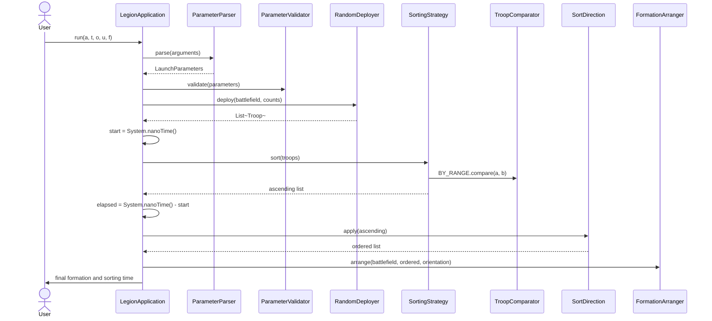

# March of the Legion

Console strategy simulator written in **Java 17**. The project is compiled with `javac` using the `build.sh` and `run.sh` scripts included in the root directory.

The program receives a configuration (sorting algorithm, sort direction, formation orientation, troop amounts, and field size), deploys the legion in random collision-free positions on a square matrix, sorts the units by their **attack range** using the chosen algorithm, reorganizes the battlefield leaving one troop type per line, and finally hands control over to an interactive session where the user commands the units by entering commands.

---

## How to Run

```bash
chmod +x build.sh run.sh test.sh

./build.sh
```

CLI Mode:

```bash
./run.sh a=b t=c o=s u=1,1,2 f=10
```

Interactive Mode (without arguments, the program prompts for each value):

```bash
./run.sh
```

Reproducible checks:

```bash
./test.sh
```

Equivalent execution without scripts:

```bash
javac -d out $(find src -name "*.java")
java -cp out legion.Troops a=m t=d o=e u=2,1,3
```

---

## Parameter Table

| Parameter | Meaning | Values | Required |
|---|---|---|---|
| `a` | Sorting algorithm | `b` bubble, `i` insertion, `s` selection, `m` merge, `q` quick, `h` heap, `c` counting, `r` radix (all implemented) | Yes |
| `t` | Sort direction | `c` ascending, `d` descending | Yes |
| `o` | Final formation orientation | `n` north (South → North), `s` south (North → South), `e` east (West → East), `w` west (East → West) | Yes |
| `u` | Unit counts by type, in the order `commander, medic, tank, sniper, infantry, engineer, artillery, antiAircraft` | 1 to 8 comma-separated integers, for example `1,1,2`; missing trailing types default to `0` | Yes |
| `f` | Side length of the square matrix | Integer between 5 and 1000 | No, defaults to `10` |

Sorting is always calculated on the unit attack range through a single shared comparator (`TroopComparator.BY_RANGE`), so every algorithm produces exactly the same order for the same input. Orientation determines whether sorted groups are stacked in rows (`n`, `s`) or columns (`e`, `w`) and from which border the formation expands.

### Decision on `t`

The project material has used `t` with two different meanings across stages. For the final delivery `t` is the **sort direction** (`c` ascending, `d` descending), which is the meaning approved in the midterm. It is applied as a single reversal of the already-sorted list in `SortDirection.apply`, never as a second algorithm. Any argument other than `c` or `d` is rejected with `E-PARAM`. Parser, validator, `SortDirection`, console messages, this README, and the tests all use this one meaning.

---

## Troop Roster

| Type | Symbol | Attack range | Abilities |
|---|---|---|---|
| Commander | `C` | 3 | `Attackable`, `Movable` |
| Medic | `M` | 1 | `Healable`, `Movable` |
| Tank | `T` | 2 | `Attackable`, `Movable` |
| Sniper | `S` | 6 | `Attackable`, `Movable` |
| Infantry | `I` | 2 | `Attackable`, `Movable` |
| Engineer | `E` | 1 | `Healable`, `Movable` |
| Artillery | `A` | 8 | `Attackable`, `Movable` (movement range 0) |
| AntiAircraft | `R` | 5 | `Attackable`, `Movable` |
| empty cell | `*` | — | — |

---

## Technical Justification

### Why Inheritance?

`Troop` is an abstract class that consolidates everything identical across all units: identifier, type, current health, maximum health, attack range, receiving damage and healing, and constructing status lines. The eight concrete units inherit that state and behavior instead of duplicating it. Inheritance models an *is-a* relationship: a sniper **is** a troop and can substitute for `Troop` anywhere in the application without breaking functionality, fulfilling the Liskov substitution principle. Inheritance is also what lets the battlefield matrix be stored as `Troop[][]`, so the renderer, sorter, and command loop operate against the abstraction and never query a concrete class.

### Why Composition?

Classes that collaborate permanently and cannot exist independently are composed. `LegionApplication` **has** a `ParameterParser`, a `ParameterValidator`, a `RandomDeployer`, and a `FormationArranger`; those objects share the application lifecycle and nobody else references them. `RandomDeployer` composes `TroopFactory` because deployment cannot happen without creating units. Composition was preferred over inheritance because the relationship is *has-a*, not *is-a*: `LegionApplication` is not a parser, it uses one. This keeps coupling low.

### Why Aggregation?

`Battlefield` aggregates troops: the matrix contains and positions them but does not own their lifecycle. Units are created by `TroopFactory`, live in the list returned by `RandomDeployer`, pass through the sorting algorithm, and are relocated on the matrix by `FormationArranger`. Clearing the grid with `clear()` leaves the troops intact in the sorted list, so the relationship is *uses and contains during the run*, not strict ownership.

### Why Interfaces?

Not all troops share the same actions, and placing `attack()` and `heal()` in the base class would force units to inherit irrelevant methods. Splitting `Movable`, `Attackable`, and `Healable` applies the Interface Segregation Principle: `Medic` and `Engineer` implement `Healable` without receiving an empty `attack()`, and `Infantry` implements `Attackable` without healing logic. Interfaces also sustain Dependency Inversion in sorting: `LegionApplication` depends on `SortingStrategy`, never on `MergeSortStrategy`.

### Why Behavior Injection?

Abilities are declared unit by unit rather than in the root of the hierarchy. `Troop` only implements `Movable`, which every unit needs (Artillery keeps the contract but returns a movement range of 0). Attack and heal are injected into the subclasses that need them. `GameLoop` checks the contract (`actor instanceof Attackable`) instead of the concrete class, so a second healer such as `Engineer` was added without touching the command loop (Open/Closed Principle).

### Why Sort by Range?

The final specification orders the legion by the range attribute of the troops. `TroopComparator.BY_RANGE` is the single comparison used by every comparison-based strategy, and the counting and radix strategies use the same `getRange()` key directly. Because the comparator is a total order (range, then identifier), the eight algorithms are interchangeable: they return exactly the same list for the same input.

---

## Applied Design Patterns

### Factory: `TroopFactory`

**Problem Solved:** prevents `new Commander(...)` calls from scattering across the codebase. A single `switch` builds every unit, so a constructor change or a new type touches one file.

```java
public Troop create(TroopType type, int number) {
    return switch (type) {
        case COMMANDER -> new Commander(number, varyHealth(COMMANDER_BASE_HEALTH));
        case MEDIC -> new Medic(number, varyHealth(MEDIC_BASE_HEALTH));
        case TANK -> new Tank(number, varyHealth(TANK_BASE_HEALTH));
        case SNIPER -> new Sniper(number, varyHealth(SNIPER_BASE_HEALTH));
        case INFANTRY -> new Infantry(number, varyHealth(INFANTRY_BASE_HEALTH));
        case ENGINEER -> new Engineer(number, varyHealth(ENGINEER_BASE_HEALTH));
        case ARTILLERY -> new Artillery(number, varyHealth(ARTILLERY_BASE_HEALTH));
        case ANTI_AIRCRAFT -> new AntiAircraft(number, varyHealth(ANTI_AIRCRAFT_BASE_HEALTH));
    };
}
```

### Strategy: `SortingStrategy`

**Problem Solved:** switching sorting algorithms at runtime based on parameter `a` without conditional logic spread through the application.

```java
public interface SortingStrategy {
    List<Troop> sort(List<Troop> troops);
    String getName();
}
```

The `SortingAlgorithm` enum is the registry that maps a console key to a concrete strategy:

```java
BUBBLE("b", BubbleSortStrategy::new),
INSERTION("i", InsertionSortStrategy::new),
SELECTION("s", SelectionSortStrategy::new),
MERGE("m", MergeSortStrategy::new),
QUICK("q", QuickSortStrategy::new),
HEAP("h", HeapSortStrategy::new),
COUNTING("c", CountingSortStrategy::new),
RADIX("r", RadixSortStrategy::new);
```

Adding an algorithm means implementing the interface and registering one enum entry; existing code is untouched (Open/Closed Principle).

### Command: `GameLoop`

**Problem Solved:** the interactive session routes each line (`move`, `attack`, `heal`, `status`, `help`, `exit`) to its own handler and keeps its own `try/catch` so a bad command never ends the session. It is an extension of the simulator and is decoupled from the sorting and formation core.

---

## Class Diagram

Source file: [`docs/diagrams/class-diagram.mmd`](docs/diagrams/class-diagram.mmd)



---

## Use Case Diagram

Source file: [`docs/diagrams/use-case-diagram.mmd`](docs/diagrams/use-case-diagram.mmd)



---

## Sorting Sequence Diagram

Source file: [`docs/diagrams/sequence-sorting.mmd`](docs/diagrams/sequence-sorting.mmd)



---

## Traceability

Every Capstone requirement is mapped to a class, method, or module in
[`docs/TRACEABILITY.md`](docs/TRACEABILITY.md).

---

## Use Cases

| # | Use Case | Input | Expected Output |
|---|---|---|---|
| UC1 | Configure execution via CLI | `./run.sh a=b t=c o=s u=1,1,2 f=10` | `CONFIGURATION` block with algorithm, direction, orientation, field size, and total troops |
| UC2 | Configure execution via menu | `./run.sh` without arguments | Interactive prompts for every value, producing the same configuration |
| UC3 | Deploy the legion | Valid configuration | `INITIAL DEPLOYMENT` map with troops in random collision-free cells, row/column indices, and a legend |
| UC4 | Sort the legion | `a=m t=c` | `SORTING REPORT` with strategy, criterion, direction, sorting time in ms, and the list ordered by range |
| UC5 | Form the sorted legion | `o=s` | `FINAL FORMATION` with one troop type per line, expanding from the selected border |
| UC6 | Interact with troops | `move I-1 1`, `heal M-1 I-1`, `status`, `exit` | Unit acts according to its pattern, state redraws, and the session closes cleanly |
| UC7 | Report a configuration error | `./run.sh a=b t=c o=s u=20,20 f=5` | `ERROR E-FIELD` block detailing the capacity limit with a controlled exit |

---

## Error Handling

`LegionException` is the common base. There is **a single `try/catch` in `Troops.main`** and another in `GameLoop` so an invalid command does not end an active session. Both delegate to `ExceptionHandler`, the sole reporting channel.

```bash
grep -rn "catch" src/ | wc -l   # 2
```

| Code | Exception | Trigger Condition | Example Message |
|---|---|---|---|
| `E-ALG` | `InvalidAlgorithmException` | Algorithm key not in the catalogue | `Unknown sorting algorithm: z` |
| `E-FIELD` | `BattlefieldSizeException` | Field size out of `[5, 1000]`, troop count over capacity, group wider than a line, more groups than lines, or a cell collision | `The battlefield holds 25 cells and 40 troops were requested.` |
| `E-CMD` | `InvalidCommandException` | Unknown command, missing arguments, occupied destination, or unit lacking the requested ability | `Destination (0, 2) is already occupied.` |
| `E-PARAM` | `InvalidParameterException` | Malformed `key=value` pair, unknown parameter key, duplicated key, missing required parameter, unknown `t`/`o` value, non-numeric or negative quantity, or an all-zero troop configuration | `Unknown parameter: x. Expected a, t, o, u or f.` |
| `E-UNEXPECTED` | Any unhandled `RuntimeException` | Failure not modelled by the domain | `Unexpected failure. The operation was cancelled.` |

---

## Sample Executions

### 1. Merge Sort, ascending, south orientation (8x8)
**Command:** `./run.sh a=m t=c o=s u=1,1,2,1,2 f=8`

```text
==============================================================
CONFIGURATION
==============================================================
Algorithm: Merge Sort
Order: ascending
Orientation: south
Field: 8x8
Troops: 7
==============================================================
SORTING REPORT
==============================================================
Strategy: Merge Sort
Criterion: attack range
Direction: ascending
Sorting time: 3.002104 ms (3002104 ns)
Result: [M-1(range 1), I-1(range 2), I-2(range 2), T-1(range 2), T-2(range 2), C-1(range 3), S-1(range 6)]
==============================================================
FINAL FORMATION
==============================================================
        0   1   2   3   4   5   6   7
  0 |   M   *   *   *   *   *   *   *
  1 |   I   I   *   *   *   *   *   *
  2 |   T   T   *   *   *   *   *   *
  3 |   C   *   *   *   *   *   *   *
  4 |   S   *   *   *   *   *   *   *
  5 |   *   *   *   *   *   *   *   *
  6 |   *   *   *   *   *   *   *   *
  7 |   *   *   *   *   *   *   *   *
==============================================================
```

### 2. Quick Sort, descending, east orientation (7x7)
**Command:** `./run.sh a=q t=d o=e u=2,1,1,1,2,1 f=7`

```text
Result: [S-1(range 6), C-2(range 3), C-1(range 3), T-1(range 2), I-2(range 2), I-1(range 2), M-1(range 1), E-1(range 1)]
==============================================================
FINAL FORMATION
==============================================================
        0   1   2   3   4   5   6
  0 |   S   C   T   I   M   E   *
  1 |   *   C   *   I   *   *   *
  2 |   *   *   *   *   *   *   *
  ...
==============================================================
```

Each column holds a single troop type, expanding from the west border because `o=e`.

### 3. Radix Sort, ascending, west orientation (6x6)
**Command:** `./run.sh a=r t=c o=w u=1,1,1 f=6`

```text
Result: [M-1(range 1), T-1(range 2), C-1(range 3)]
==============================================================
FINAL FORMATION
==============================================================
        0   1   2   3   4   5
  0 |   *   *   *   C   T   M
  1 |   *   *   *   *   *   *
  ...
==============================================================
```

The formation grows from the east border (column `N-1`) towards the west.

### 4. Interactive session
**Command:** `./run.sh a=m t=c o=s u=1,1,2,1,2 f=8` then `status`, `heal M-1 I-1`, `exit`

```text
legion> status
M-1 Medic health=143/143 range=1 movement=3 pattern=lateral
I-1 Infantry health=150/150 range=2 movement=2 pattern=straight
...
legion> heal M-1 I-1
Action executed: M-1 heals I-1
legion> exit
Session closed.
```

### 5. Error: unknown orientation
**Command:** `./run.sh a=b t=c o=z u=1,1,1 f=6`

```text
==============================================================
ERROR E-PARAM
Unknown orientation: z. Expected n, s, e or w.
==============================================================
```

### 6. Error: field too small for the troops
**Command:** `./run.sh a=b t=c o=s u=20,20 f=5`

```text
==============================================================
ERROR E-FIELD
The battlefield holds 25 cells and 40 troops were requested.
==============================================================
```

### 7. Error: line capacity overflow
**Command:** `./run.sh a=c t=c o=e u=1,2,5,5,13 f=6`

```text
==============================================================
ERROR E-FIELD
A line holds 6 units and 13 Infantry were requested.
==============================================================
```

### 8. Default field size
**Command:** `./run.sh a=b t=c o=s u=1,1,1` produces a `10x10` battlefield because `f` is omitted.

### 9. Error: unknown parameter
**Command:** `./run.sh a=b t=c o=s u=1,1,1 x=9 f=6`

```text
==============================================================
ERROR E-PARAM
Unknown parameter: x. Expected a, t, o, u or f.
==============================================================
```

---

## Reproducible Checks

`./test.sh` compiles `src` and `test` together and runs `legion.test.TestRunner`,
a dependency-free harness (the Capstone forbids build tools). It covers:

- **parser** — valid line, missing/unknown/duplicated parameter, malformed `key=value`, invalid algorithm/direction/orientation, non-numeric and negative quantities, case-insensitive keys and enum values;
- **validator** — field size `[5, 1000]` including both bounds, exactly-full battlefield, capacity exceeded, group wider than a line, too many groups, empty configuration;
- **sorting** — every one of the eight strategies on mixed, empty, single, sorted, reversed, equal-range, min/max-range and large datasets; all eight agree on the same ascending and descending order; every strategy orders by range and not by health;
- **battlefield** — bounds, exclusive placement, size limits;
- **formation** — the four orientations, one type per line, single type, exact line capacity, identity preserved;
- **deployment** — no repeated position, every troop placed once, small and large fields, nothing lost or renamed through sorting and formation;
- **regression** — a midterm-style command still runs the full pipeline and the previously approved behaviours still hold.

Current status: **133 checks, 0 failures**.

---

## Project Structure

```
legion/
├── build.sh
├── run.sh
├── test.sh
├── README.md
├── README_ES.md
├── docs/
│   ├── TRACEABILITY.md
│   └── diagrams/
│       ├── class-diagram.mmd
│       ├── use-case-diagram.mmd
│       └── sequence-sorting.mmd
├── src/legion/
│   ├── Troops.java
│   ├── LegionApplication.java
│   ├── console/ConsoleWriter.java
│   ├── errors/
│   │   ├── LegionException.java
│   │   ├── ExceptionHandler.java
│   │   └── types/
│   ├── setup/
│   │   ├── LaunchParameters.java
│   │   ├── ParameterParser.java
│   │   ├── InteractiveParameterReader.java
│   │   └── ParameterValidator.java
│   ├── troops/
│   │   ├── Troop.java
│   │   ├── TroopType.java
│   │   ├── TroopFactory.java
│   │   ├── abilities/
│   │   └── units/
│   │       ├── Commander.java
│   │       ├── Medic.java
│   │       ├── Tank.java
│   │       ├── Sniper.java
│   │       ├── Infantry.java
│   │       ├── Engineer.java
│   │       ├── Artillery.java
│   │       └── AntiAircraft.java
│   ├── battlefield/
│   │   ├── Battlefield.java
│   │   ├── Position.java
│   │   ├── Orientation.java
│   │   ├── BattlefieldRenderer.java
│   │   ├── RandomDeployer.java
│   │   └── FormationArranger.java
│   ├── sorting/
│   │   ├── SortingStrategy.java
│   │   ├── SortingAlgorithm.java
│   │   ├── SortDirection.java
│   │   ├── TroopComparator.java
│   │   └── strategies/
│   └── commands/GameLoop.java
└── test/legion/test/
    ├── TestRunner.java
    ├── TestReport.java
    ├── ParserTests.java
    ├── ValidatorTests.java
    ├── SortingTests.java
    ├── BattlefieldTests.java
    ├── FormationTests.java
    ├── DeploymentTests.java
    └── RegressionTests.java
```
