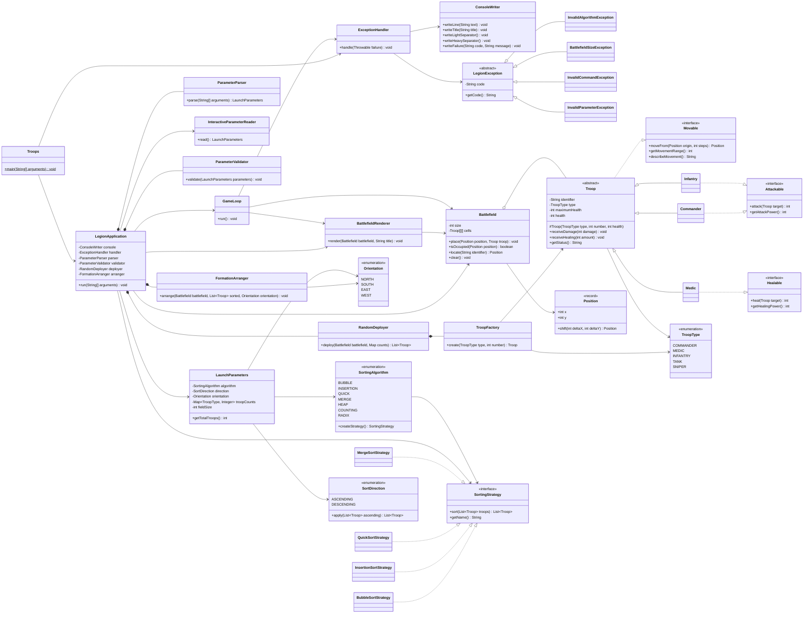
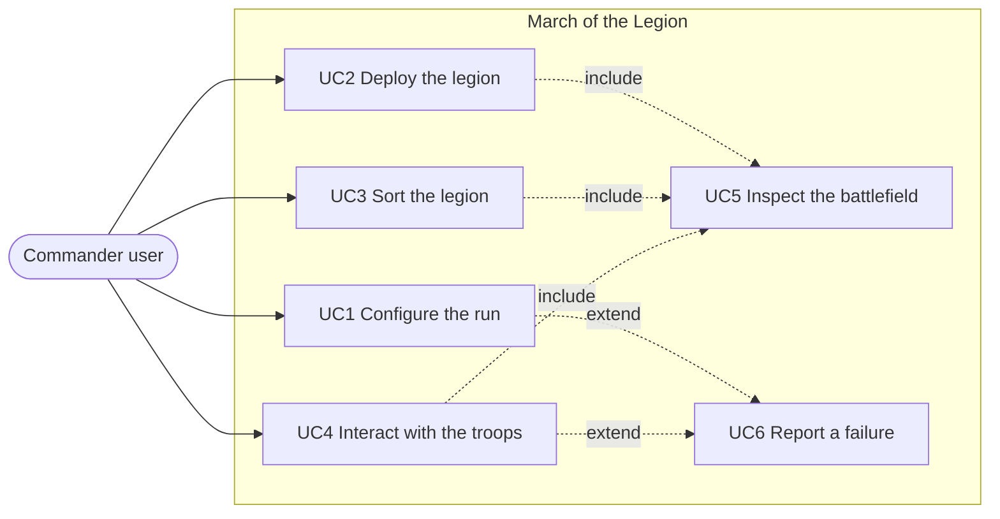

# March of the Legion

Simulador de estrategia por consola escrito en **Java 17**. El proyecto se compila con `javac` mediante los scripts `build.sh` y `run.sh` incluidos en la raíz.

El programa recibe una configuración (algoritmo de ordenamiento, sentido del orden, orientación de la formación, cantidad de tropas y tamaño del campo), despliega la legión en posiciones aleatorias sin colisiones sobre una matriz cuadrada, ordena las unidades por sus puntos de vida usando el algoritmo elegido, reorganiza el campo dejando un tipo de tropa por línea y finalmente entrega el control a una sesión interactiva donde el usuario comanda a las unidades escribiendo comandos.

---

## Cómo ejecutar

```bash
chmod +x build.sh run.sh

./build.sh
```

Modo CLI:

```bash
./run.sh a=b t=c o=s u=1,1,2 f=6
```

Modo interactivo (sin argumentos, el programa pregunta cada valor):

```bash
./run.sh
```

Equivalente sin scripts:

```bash
javac -d out $(find src -name "*.java")
java -cp out legion.Troops a=i t=d o=e u=2,1,3
```

---

## Tabla de parámetros

| Parámetro | Significado | Valores | Obligatorio |
|---|---|---|---|
| `a` | Algoritmo de ordenamiento | `b` bubble, `i` insertion (implementados); `q`, `m`, `h`, `c`, `r` declarados como stub | Sí |
| `t` | Sentido del orden | `c` creciente, `d` decreciente | Sí |
| `o` | Orientación de la formación final | `n` norte, `s` sur, `e` este, `w` oeste | Sí |
| `u` | Cantidad de unidades por tipo, en el orden `commander,medic,infantry` | Enteros separados por coma, por ejemplo `1,1,2` | Sí |
| `f` | Lado de la matriz cuadrada | Entero entre 2 y 1000 | No, por defecto `6` |

El orden se calcula siempre sobre los puntos de vida de la unidad. La orientación decide si los grupos ordenados se apilan en filas (`n`, `s`) o en columnas (`w`, `e`) y desde qué borde crece la formación.

---

## Justificación técnica

### ¿Por qué herencia?

`Troop` es una clase abstracta que concentra todo lo que es idéntico en cualquier unidad: identificador, tipo, vida actual, vida máxima, recepción de daño y de curación, y la construcción de la línea de estado. `Commander`, `Medic` e `Infantry` heredan ese estado y ese comportamiento en lugar de repetirlo tres veces. La herencia aquí modela una relación *es un*: un médico **es** una tropa, y puede sustituir a `Troop` en cualquier punto del programa sin romperlo, que es exactamente lo que exige Liskov. Además, la herencia es lo que permite que el campo de batalla sea un `Troop[][]`: el renderer, el ordenador y el ciclo de comandos trabajan contra la abstracción y nunca preguntan por la clase concreta.

### ¿Por qué composición?

Las clases que colaboran de forma permanente y no pueden existir por separado se componen. `LegionApplication` **tiene** un `ParameterParser`, un `ParameterValidator`, un `RandomDeployer` y un `FormationArranger`; esos objetos nacen y mueren con la aplicación y nadie más los referencia. Lo mismo ocurre con `RandomDeployer`, que compone a `TroopFactory` porque no tiene sentido desplegar sin poder crear unidades. La composición se prefirió a la herencia en todos estos casos porque la relación es *tiene un*, no *es un*: `LegionApplication` no es un parser, lo usa. Esto además mantiene el acoplamiento bajo: cambiar el parser no obliga a tocar la jerarquía de nadie.

### ¿Por qué agregación?

`Battlefield` agrega tropas: la matriz las contiene y las posiciona, pero no es su dueña en términos de ciclo de vida. Las unidades las crea `TroopFactory`, viven en la lista que devuelve `RandomDeployer`, pasan por el algoritmo de ordenamiento y después se vuelven a colocar en la matriz mediante `FormationArranger`. Si el campo se vacía con `clear()`, las tropas siguen existiendo en la lista ordenada. Por eso la relación es agregación y no composición: es un *usa y contiene mientras dure el turno*, no un *es dueño de*.

### ¿Por qué interfaces?

Porque no todas las tropas hacen lo mismo, y una clase abstracta con métodos `attack()` y `heal()` obligaría a cada unidad a heredar métodos que no le corresponden. Separando `Movable`, `Attackable` y `Healable` se aplica el principio de segregación de interfaces: `Medic` implementa `Healable` y jamás recibe un `attack()` vacío o que lance excepción, y `Infantry` implementa `Attackable` sin cargar con la lógica de curación. Las interfaces también sostienen la inversión de dependencias en el ordenamiento: `LegionApplication` depende de `SortingStrategy`, nunca de `BubbleSortStrategy`, así que agregar un algoritmo no modifica al orquestador.

### ¿Por qué inyección de comportamientos?

Porque las habilidades se declaran unidad por unidad en lugar de vivir en el tronco de la jerarquía. `Troop` sólo implementa `Movable`, que es lo único universal; atacar y curar se inyectan en las subclases que corresponden. El efecto práctico se ve en `GameLoop`: antes de ejecutar `attack` o `heal` el ciclo pregunta por el contrato (`actor instanceof Attackable`) y no por la clase concreta. Cuando en la segunda entrega entren `Tank`, `Sniper` o un futuro `Engineer` reparador, el ciclo de comandos no cambia ni una línea: basta con que la nueva unidad declare qué interfaces implementa.

---

## Patrones aplicados

### Factory — `TroopFactory`

**Problema que resuelve:** evitar que el `new` de cada unidad concreta se disperse por el código. Si el despliegue creara `new Commander(...)` directamente, cada cambio en el constructor o cada tipo nuevo obligaría a tocar varios archivos.

```java
public Troop create(TroopType type, int number) {
    return switch (type) {
        case COMMANDER -> new Commander(number, varyHealth(COMMANDER_BASE_HEALTH));
        case MEDIC -> new Medic(number, varyHealth(MEDIC_BASE_HEALTH));
        case INFANTRY -> new Infantry(number, varyHealth(INFANTRY_BASE_HEALTH));
        case TANK -> throw new IllegalArgumentException(TroopType.TANK.getLabel() + NOT_IMPLEMENTED);
        case SNIPER -> throw new IllegalArgumentException(TroopType.SNIPER.getLabel() + NOT_IMPLEMENTED);
    };
}
```

Los tipos pendientes ya están en el enum y en el `switch`, lo que documenta el plan completo sin implementarlo todavía.

### Strategy — `SortingStrategy`

**Problema que resuelve:** poder cambiar el algoritmo de ordenamiento en tiempo de ejecución, según el parámetro `a`, sin condicionales repartidos por la aplicación.

```java
public interface SortingStrategy {
    List<Troop> sort(List<Troop> troops);
    String getName();
}
```

El enum `SortingAlgorithm` es el catálogo que asocia la clave de consola con la estrategia:

```java
BUBBLE("b", BubbleSortStrategy::new, true),
INSERTION("i", InsertionSortStrategy::new, true),
QUICK("q", QuickSortStrategy::new, false),
MERGE("m", MergeSortStrategy::new, false);
```

Agregar un algoritmo es crear una clase que implemente la interfaz y añadir una entrada al enum: código existente intacto (Open/Closed).

---

## Diagrama de clases

Archivo fuente: [`docs/diagrams/class-diagram.mmd`](docs/diagrams/class-diagram.mmd)



## Diagrama de casos de uso

Archivo fuente: [`docs/diagrams/use-case-diagram.mmd`](docs/diagrams/use-case-diagram.mmd)



---

## Casos de uso

| # | Caso de uso | Entrada | Salida esperada |
|---|---|---|---|
| UC1 | Configurar la ejecución por CLI | `./run.sh a=b t=c o=s u=1,1,2 f=6` | Bloque `CONFIGURATION` con algoritmo, orden, orientación, campo y total de tropas |
| UC2 | Configurar la ejecución por menú | `./run.sh` sin argumentos | El programa pregunta algoritmo, orden, orientación, cantidades y tamaño, y produce la misma configuración |
| UC3 | Desplegar la legión | Configuración válida | Campo `INITIAL DEPLOYMENT` con las tropas en celdas aleatorias, sin colisiones, y leyenda de símbolos |
| UC4 | Ordenar la legión | `a=b t=c` | Bloque `SORTING REPORT` con estrategia, sentido, tiempo en nanosegundos y la lista ordenada por vida |
| UC5 | Formar la legión ordenada | `o=s` | Campo `FINAL FORMATION` con un tipo de tropa por línea, creciendo desde el borde indicado |
| UC6 | Interactuar con las tropas | `move I-1 2`, `status`, `help`, `exit` | La unidad se mueve según su patrón, se redibuja el estado y la sesión cierra limpiamente |
| UC7 | Reportar un error de configuración | `./run.sh a=b t=c o=s u=1,1,20 f=6` | Bloque `ERROR E-FIELD` con el mensaje del límite de capacidad y salida controlada |

---

## Manejo de errores

Diseño: `LegionException` es la raíz común, existe **un solo `try/catch` en `Troops.main`** y otro en `GameLoop` para que un comando inválido no mate la sesión. Ambos delegan en `ExceptionHandler`, que es el único que imprime errores.

```bash
grep -rn "catch" src/ | wc -l   # 2
```

| Código | Excepción | Cuándo se lanza | Mensaje de ejemplo |
|---|---|---|---|
| `E-ALG` | `InvalidAlgorithmException` | Clave de algoritmo inexistente o todavía en stub | `Sorting algorithm q is planned for the second milestone. Available now: b, i` |
| `E-FIELD` | `BattlefieldSizeException` | Tamaño de campo fuera de rango, tropas por encima de la capacidad o posición fuera de la matriz | `A line holds 6 units and 20 Infantry were requested.` |
| `E-CMD` | `InvalidCommandException` | Comando desconocido, argumentos faltantes, destino ocupado o unidad sin la habilidad pedida | `M-1 cannot attack.` |
| `E-PARAM` | `InvalidParameterException` | Par `clave=valor` mal formado, parámetro obligatorio ausente o valor no numérico | `Malformed parameter: a. Expected key=value.` |
| `E-UNEXPECTED` | Cualquier `RuntimeException` no prevista | Falla no contemplada por el dominio | `Unexpected failure. The operation was cancelled.` |

---

## Estado del milestone

### Funcionando

- [x] Proyecto Java `legion` compilable con `javac` mediante `build.sh`.
- [x] Parseo de parámetros `clave=valor` y modo interactivo con `Scanner`.
- [x] Validación de algoritmo, sentido, orientación, cantidades y capacidad del campo.
- [x] Jerarquía POO: `Troop` abstracta, atributos `private`, constructor `protected`, tres unidades concretas.
- [x] Interfaces `Movable`, `Attackable` y `Healable` inyectadas por unidad.
- [x] Patrones Factory (`TroopFactory`) y Strategy (`SortingStrategy` + `SortingAlgorithm`).
- [x] Campo de batalla con matriz configurable, despliegue aleatorio sin colisiones y render con leyenda.
- [x] Bubble Sort e Insertion Sort implementados, con medición en `System.nanoTime()`.
- [x] Formación final con un tipo de tropa por línea y cuatro orientaciones.
- [x] Manejo centralizado de excepciones con jerarquía propia y códigos.
- [x] `GameLoop` con `move`, `attack`, `heal`, `status`, `help` y `exit`.
- [x] Diagrama de clases y diagrama de casos de uso en Mermaid.

### Declarado como stub para la segunda entrega

- [ ] `QuickSortStrategy`, `MergeSortStrategy`, `HeapSortStrategy`, `CountingSortStrategy`, `RadixSortStrategy`: la clase existe y está registrada en el enum, `sort()` lanza `UnsupportedOperationException`.
- [ ] Tipos `TANK` y `SNIPER`: presentes en `TroopType`, rechazados explícitamente en `TroopFactory`.
- [ ] `attack` y `heal` del `GameLoop` validan la habilidad por interfaz pero imprimen una acción simulada.
- [ ] Comparativa de performance entre algoritmos.
- [ ] Sistema de turnos, bandos e IA.
- [ ] Patrón Command con registro dinámico y sugerencia de comando cercano.
- [ ] Logger a archivo `error.log`.

---

## Ejecuciones de Prueba (15 Executions)

A continuación se documentan 15 ejecuciones reales del sistema cubriendo flujos exitosos con distintas configuraciones (algoritmos, sentidos, orientaciones, dimensiones y modos) así como la verificación del manejo de excepciones.

### 1. Bubble Sort Ascendente - Orientación Sur (Matriz 6x6)
**Comando:** `./run.sh a=b t=c o=s u=1,1,2 f=6`
**Resultado:** Despliegue aleatorio, ordenamiento Bubble Sort por HP en orden creciente (`M-1`, `I-2`, `I-1`, `C-1`) y alineación en filas desde el borde sur.

```text
==============================================================
CONFIGURATION
==============================================================
Algorithm: Bubble Sort
Order: ascending
Orientation: south
Field: 6x6
Troops: 4
==============================================================
SORTING REPORT
==============================================================
Strategy: Bubble Sort
Direction: ascending
Elapsed: 94417 ns (0.094417 ms)
Result: [M-1(128), I-2(166), I-1(176), C-1(193)]
==============================================================
FINAL FORMATION
==============================================================
* * * * * *
* * * * * *
* * * * * *
C * * * * *
I I * * * *
M * * * * *
==============================================================
```

---

### 2. Insertion Sort Descendente - Orientación Norte (Matriz 8x8)
**Comando:** `./run.sh a=i t=d o=n u=2,2,4 f=8`
**Resultado:** Ordenamiento Insertion Sort descendente por HP sobre 8 unidades (`C-1`, `C-2`, `I-1`, `I-2`, `M-2`, `I-3`, `I-4`, `M-1`) alineadas desde el borde norte.

```text
==============================================================
CONFIGURATION
==============================================================
Algorithm: Insertion Sort
Order: descending
Orientation: north
Field: 8x8
Troops: 8
==============================================================
SORTING REPORT
==============================================================
Strategy: Insertion Sort
Direction: descending
Elapsed: 268154 ns (0.268154 ms)
Result: [C-1(200), C-2(185), I-1(176), I-2(154), M-2(147), I-3(145), I-4(142), M-1(142)]
==============================================================
FINAL FORMATION
==============================================================
C C * * * * * *
I I I I * * * *
M M * * * * * *
* * * * * * * *
* * * * * * * *
* * * * * * * *
* * * * * * * *
* * * * * * * *
==============================================================
```

---

### 3. Bubble Sort Ascendente - Orientación Este (Matriz 5x5)
**Comando:** `./run.sh a=b t=c o=e u=1,2,3 f=5`
**Resultado:** Alineación vertical en columnas apoyadas contra el borde Este del campo.

```text
==============================================================
CONFIGURATION
==============================================================
Algorithm: Bubble Sort
Order: ascending
Orientation: east
Field: 5x5
Troops: 6
==============================================================
SORTING REPORT
==============================================================
Strategy: Bubble Sort
Direction: ascending
Elapsed: 77410 ns (0.07741 ms)
Result: [M-1(123), M-2(124), I-2(150), I-3(164), I-1(179), C-1(209)]
==============================================================
FINAL FORMATION
==============================================================
* * C I M
* * * I M
* * * I *
* * * * *
* * * * *
==============================================================
```

---

### 4. Insertion Sort Descendente - Orientación Oeste (Matriz 6x6)
**Comando:** `./run.sh a=i t=d o=w u=2,1,2 f=6`
**Resultado:** Alineación vertical en columnas apoyadas contra el borde Oeste del campo.

```text
==============================================================
CONFIGURATION
==============================================================
Algorithm: Insertion Sort
Order: descending
Orientation: west
Field: 6x6
Troops: 5
==============================================================
SORTING REPORT
==============================================================
Strategy: Insertion Sort
Direction: descending
Elapsed: 128697 ns (0.128697 ms)
Result: [C-2(193), C-1(180), I-1(177), M-1(149), I-2(142)]
==============================================================
FINAL FORMATION
==============================================================
C I M * * *
C I * * * *
* * * * * *
* * * * * *
* * * * * *
* * * * * *
==============================================================
```

---

### 5. Sesión Interactiva REPL (`GameLoop` Comandos)
**Comando:** `./run.sh a=b t=c o=s u=1,1,2 f=6`
**Interacción:** `status`, `move I-1 2`, `attack I-1 C-1`, `heal M-1 I-1`, `exit`
**Resultado:** Ejecución interactiva de comandos con redibujado de estado, verificación de límites e invocación de habilidades.

```text
legion> status
==============================================================
BATTLEFIELD
==============================================================
C-1 Commander health=207/207 range=3 pattern=diagonal
I-2 Infantry health=158/158 range=2 pattern=straight
I-1 Infantry health=165/165 range=2 pattern=straight
M-1 Medic health=132/132 range=1 pattern=lateral
--------------------------------------------------------------
legion> move I-1 2
ERROR E-CMD: Destination (1, 6) is outside the battlefield.
legion> attack I-1 C-1
Action executed: I-1 attacks C-1
legion> heal M-1 I-1
Action executed: M-1 heals I-1
legion> exit
Session closed.
```

---

### 6. Error E-ALG: Clave de Algoritmo Inexistente
**Comando:** `./run.sh a=z t=c o=s u=1,1,2 f=6`
**Resultado:** Captura centralizada en `ExceptionHandler` con código `E-ALG`.

```text
==============================================================
ERROR E-ALG
Unknown sorting algorithm: z
==============================================================
```

---

### 7. Error E-ALG: Algoritmo Stub Declarado para Hito 2
**Comando:** `./run.sh a=q t=c o=s u=1,1,2 f=6`
**Resultado:** Rechazo controlado del stub de QuickSort (`a=q`).

```text
==============================================================
ERROR E-ALG
Sorting algorithm q is planned for the second milestone. Available now: b, i
==============================================================
```

---

### 8. Error E-PARAM: Sentido de Orden Inválido
**Comando:** `./run.sh a=b t=x o=s u=1,1,2 f=6`
**Resultado:** Rechazo de valor no reconocido para la dirección de orden.

```text
==============================================================
ERROR E-PARAM
Unknown sort direction: x. Expected c or d.
==============================================================
```

---

### 9. Error E-PARAM: Orientación Inválida
**Comando:** `./run.sh a=b t=c o=z u=1,1,2 f=6`
**Resultado:** Rechazo de valor no reconocido para la orientación de la formación.

```text
==============================================================
ERROR E-PARAM
Unknown orientation: z. Expected n, s, e or w.
==============================================================
```

---

### 10. Error E-PARAM: Parámetro Mal Formado
**Comando:** `./run.sh invalid_arg_string`
**Resultado:** Detección de sintaxis inválida sin formato `clave=valor`.

```text
==============================================================
ERROR E-PARAM
Malformed parameter: invalid_arg_string. Expected key=value.
==============================================================
```

---

### 11. Error E-FIELD: Tamaño de Campo Inferior al Mínimo (`f=1`)
**Comando:** `./run.sh a=b t=c o=s u=1,1,2 f=1`
**Resultado:** Validación del límite inferior permitido (`f >= 2`).

```text
==============================================================
ERROR E-FIELD
Field size must be between 2 and 1000, received 1.
==============================================================
```

---

### 12. Error E-FIELD: Tamaño de Campo Superior al Máximo (`f=1500`)
**Comando:** `./run.sh a=b t=c o=s u=1,1,2 f=1500`
**Resultado:** Validación del límite superior permitido (`f <= 1000`).

```text
==============================================================
ERROR E-FIELD
Field size must be between 2 and 1000, received 1500.
==============================================================
```

---

### 13. Error E-FIELD: Capacidad de Línea Excedida (`u=1,1,10` en Matriz 6x6)
**Comando:** `./run.sh a=b t=c o=s u=1,1,10 f=6`
**Resultado:** Rechazo cuando una categoría de tropa supera el número de celdas por fila/columna.

```text
==============================================================
ERROR E-FIELD
A line holds 6 units and 10 Infantry were requested.
==============================================================
```

---

### 14. Modo Interactivo Guiado (Interactive Parameter Reader)
**Comando:** `./run.sh` *(sin argumentos CLI, respuestas ingresadas por consola)*
**Resultado:** Lectura paso a paso de los parámetros mediante `InteractiveParameterReader` y `Scanner`.

```text
==============================================================
INTERACTIVE SETUP
==============================================================
Sorting algorithm (b=bubble, i=insertion): b
Order (c=ascending, d=descending): c
Orientation (n, s, e, w): n
Amount of Commander: 1
Amount of Medic: 1
Amount of Infantry: 2
Field size (empty for 6): 6
==============================================================
CONFIGURATION
==============================================================
Algorithm: Bubble Sort
Order: ascending
Orientation: north
Field: 6x6
Troops: 4
==============================================================
```

---

### 15. Matriz Mínima (3x3) con 1 Unidad por Tipo
**Comando:** `./run.sh a=i t=c o=s u=1,1,1 f=3`
**Resultado:** Comprobación del ciclo completo en un tablero de dimensión mínima `3x3`.

```text
==============================================================
CONFIGURATION
==============================================================
Algorithm: Insertion Sort
Order: ascending
Orientation: south
Field: 3x3
Troops: 3
==============================================================
FINAL FORMATION
==============================================================
C * *
I * *
M * *
==============================================================
```

---

## Estructura del proyecto

```
legion/
├── build.sh
├── run.sh
├── README.md
├── README_EN.md
├── docs/diagrams/
│   ├── class-diagram.mmd
│   └── use-case-diagram.mmd
└── src/legion/
    ├── Troops.java
    ├── LegionApplication.java
    ├── console/ConsoleWriter.java
    ├── errors/
    │   ├── LegionException.java
    │   ├── ExceptionHandler.java
    │   └── types/
    ├── setup/
    │   ├── LaunchParameters.java
    │   ├── ParameterParser.java
    │   ├── InteractiveParameterReader.java
    │   └── ParameterValidator.java
    ├── troops/
    │   ├── Troop.java
    │   ├── TroopType.java
    │   ├── TroopFactory.java
    │   ├── abilities/
    │   └── units/
    ├── battlefield/
    │   ├── Battlefield.java
    │   ├── Position.java
    │   ├── Orientation.java
    │   ├── BattlefieldRenderer.java
    │   ├── RandomDeployer.java
    │   └── FormationArranger.java
    ├── sorting/
    │   ├── SortingStrategy.java
    │   ├── SortingAlgorithm.java
    │   ├── SortDirection.java
    │   └── strategies/
    └── commands/GameLoop.java
```
