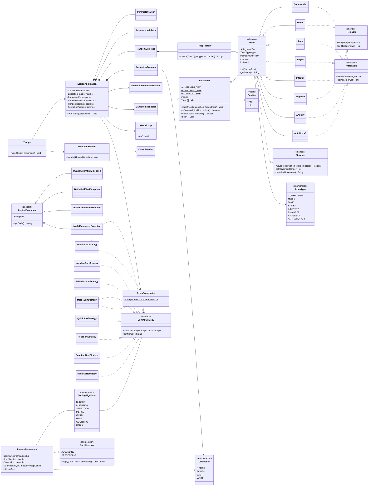
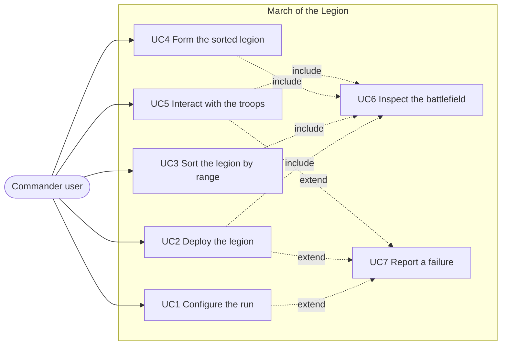
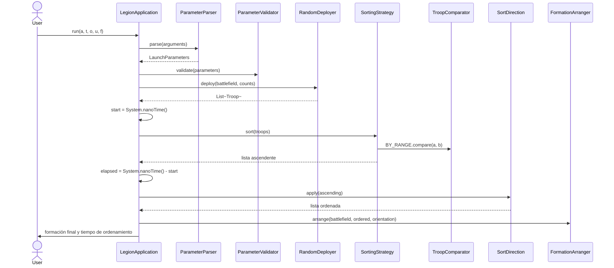

# March of the Legion

Simulador de estrategia por consola escrito en **Java 17**. El proyecto se compila con `javac` mediante los scripts `build.sh` y `run.sh` incluidos en la raíz.

El programa recibe una configuración (algoritmo de ordenamiento, sentido del orden, orientación de la formación, cantidad de tropas y tamaño del campo), despliega la legión en posiciones aleatorias sin colisiones sobre una matriz cuadrada, ordena las unidades por su **rango de ataque** usando el algoritmo elegido, reorganiza el campo dejando un tipo de tropa por línea y finalmente entrega el control a una sesión interactiva donde el usuario comanda a las unidades escribiendo comandos.

---

## Cómo ejecutar

```bash
chmod +x build.sh run.sh test.sh

./build.sh
```

Modo CLI:

```bash
./run.sh a=b t=c o=s u=1,1,2 f=10
```

Modo interactivo (sin argumentos, el programa pregunta cada valor):

```bash
./run.sh
```

Pruebas reproducibles:

```bash
./test.sh
```

Equivalente sin scripts:

```bash
javac -d out $(find src -name "*.java")
java -cp out legion.Troops a=m t=d o=e u=2,1,3
```

---

## Tabla de parámetros

| Parámetro | Significado | Valores | Obligatorio |
|---|---|---|---|
| `a` | Algoritmo de ordenamiento | `b` bubble, `i` insertion, `s` selection, `m` merge, `q` quick, `h` heap, `c` counting, `r` radix (todos implementados) | Sí |
| `t` | Sentido del orden | `c` creciente, `d` decreciente | Sí |
| `o` | Orientación de la formación final | `n` norte (Sur → Norte), `s` sur (Norte → Sur), `e` este (Oeste → Este), `w` oeste (Este → Oeste) | Sí |
| `u` | Cantidad de unidades por tipo, en el orden `comandante, médico, tanque, sniper, infantería, ingeniero, artillería, antiaérea` | De 1 a 8 enteros separados por coma, por ejemplo `1,1,2`; los tipos finales que falten valen `0` | Sí |
| `f` | Lado de la matriz cuadrada | Entero entre 5 y 1000 | No, por defecto `10` |

El orden se calcula siempre sobre el rango de ataque de la unidad mediante un único comparador compartido (`TroopComparator.BY_RANGE`), de modo que todos los algoritmos producen exactamente el mismo resultado para la misma entrada. La orientación decide si los grupos ordenados se apilan en filas (`n`, `s`) o en columnas (`e`, `w`) y desde qué borde crece la formación.

### Decisión sobre `t`

El material del proyecto ha usado `t` con dos significados a lo largo de las etapas. Para la entrega final `t` es el **sentido del orden** (`c` creciente, `d` decreciente), que es el significado aprobado en el midterm. Se aplica como una única inversión de la lista ya ordenada en `SortDirection.apply`, nunca como un segundo algoritmo. Cualquier valor distinto de `c` o `d` se rechaza con `E-PARAM`. Parser, validador, `SortDirection`, mensajes de consola, este README y las pruebas usan este único significado.

---

## Catálogo de tropas

| Tipo | Símbolo | Rango de ataque | Capacidades |
|---|---|---|---|
| Comandante | `C` | 3 | `Attackable`, `Movable` |
| Médico | `M` | 1 | `Healable`, `Movable` |
| Tanque | `T` | 2 | `Attackable`, `Movable` |
| Sniper | `S` | 6 | `Attackable`, `Movable` |
| Infantería | `I` | 2 | `Attackable`, `Movable` |
| Ingeniero | `E` | 1 | `Healable`, `Movable` |
| Artillería | `A` | 8 | `Attackable`, `Movable` (rango de movimiento 0) |
| Antiaérea | `R` | 5 | `Attackable`, `Movable` |
| celda vacía | `*` | — | — |

---

## Justificación técnica

### ¿Por qué herencia?

`Troop` es una clase abstracta que concentra todo lo idéntico en cualquier unidad: identificador, tipo, vida actual, vida máxima, rango de ataque, recepción de daño y de curación, y la construcción de la línea de estado. Las ocho unidades concretas heredan ese estado y ese comportamiento en lugar de repetirlo. La herencia modela una relación *es un*: un sniper **es** una tropa y puede sustituir a `Troop` en cualquier punto del programa sin romperlo, tal como exige Liskov. La herencia también permite que el campo sea un `Troop[][]`: el renderer, el ordenador y el ciclo de comandos trabajan contra la abstracción y nunca preguntan por la clase concreta.

### ¿Por qué composición?

Las clases que colaboran de forma permanente y no pueden existir por separado se componen. `LegionApplication` **tiene** un `ParameterParser`, un `ParameterValidator`, un `RandomDeployer` y un `FormationArranger`; nacen y mueren con la aplicación y nadie más los referencia. `RandomDeployer` compone a `TroopFactory` porque no se puede desplegar sin crear unidades. Se prefirió la composición a la herencia porque la relación es *tiene un*, no *es un*.

### ¿Por qué agregación?

`Battlefield` agrega tropas: la matriz las contiene y las posiciona, pero no es dueña de su ciclo de vida. Las unidades las crea `TroopFactory`, viven en la lista que devuelve `RandomDeployer`, pasan por el algoritmo de ordenamiento y luego `FormationArranger` las recoloca. Si el campo se vacía con `clear()`, las tropas siguen en la lista ordenada, así que la relación es agregación, no composición.

### ¿Por qué interfaces?

Porque no todas las tropas hacen lo mismo, y una clase base con `attack()` y `heal()` obligaría a heredar métodos ajenos. Separar `Movable`, `Attackable` y `Healable` aplica la segregación de interfaces: `Medic` e `Engineer` implementan `Healable` sin recibir un `attack()` vacío, e `Infantry` implementa `Attackable` sin lógica de curación. Las interfaces también sostienen la inversión de dependencias: `LegionApplication` depende de `SortingStrategy`, nunca de `MergeSortStrategy`.

### ¿Por qué inyección de comportamientos?

Las habilidades se declaran unidad por unidad y no en el tronco de la jerarquía. `Troop` sólo implementa `Movable`, que todas necesitan (Artillería mantiene el contrato pero devuelve rango de movimiento 0). Atacar y curar se inyectan en las subclases que corresponden. `GameLoop` pregunta por el contrato (`actor instanceof Attackable`) y no por la clase concreta, así que un segundo sanador como `Engineer` se agregó sin tocar el ciclo de comandos (principio Open/Closed).

### ¿Por qué ordenar por rango?

La especificación final ordena la legión por el atributo de rango de las tropas. `TroopComparator.BY_RANGE` es la única comparación que usan todas las estrategias por comparación, y las estrategias counting y radix usan directamente la misma clave `getRange()`. Como el comparador es un orden total (rango y luego identificador), los ocho algoritmos son intercambiables: devuelven exactamente la misma lista para la misma entrada.

---

## Patrones aplicados

### Factory — `TroopFactory`

**Problema que resuelve:** evitar que el `new` de cada unidad concreta se disperse por el código. Un único `switch` construye todas las unidades.

```java
public Troop create(TroopType type, int number) {
    return switch (type) {
        case COMMANDER -> new Commander(number, varyHealth(COMMANDER_BASE_HEALTH));
        case MEDIC -> new Medic(number, varyHealth(MEDIC_BASE_HEALTH));
        case TANK -> new Tank(number, varyHealth(TANK_BASE_HEALTH));
        case SNIPER -> new Sniper(number, varyHealth(SNIPER_BASE_HEALTH));
        case INFANTRY -> new Infantry(number, varyHealth(INFANTRY_BASE_HEALTH));
        case ENGINEER -> new Engineer(number, varyHealth(ENGINEER_BASE_HEALTH));
        case ARTILLERY -> new Artillery(number, varyHealth(ARTILLERY_BASE_HEALTH));
        case ANTI_AIRCRAFT -> new AntiAircraft(number, varyHealth(ANTI_AIRCRAFT_BASE_HEALTH));
    };
}
```

### Strategy — `SortingStrategy`

**Problema que resuelve:** cambiar el algoritmo de ordenamiento en tiempo de ejecución según el parámetro `a`, sin condicionales repartidos.

```java
public interface SortingStrategy {
    List<Troop> sort(List<Troop> troops);
    String getName();
}
```

El enum `SortingAlgorithm` es el catálogo que asocia la clave de consola con la estrategia:

```java
BUBBLE("b", BubbleSortStrategy::new),
INSERTION("i", InsertionSortStrategy::new),
SELECTION("s", SelectionSortStrategy::new),
MERGE("m", MergeSortStrategy::new),
QUICK("q", QuickSortStrategy::new),
HEAP("h", HeapSortStrategy::new),
COUNTING("c", CountingSortStrategy::new),
RADIX("r", RadixSortStrategy::new);
```

Agregar un algoritmo es implementar la interfaz y registrar una entrada del enum; el código existente queda intacto (Open/Closed).

### Command — `GameLoop`

**Problema que resuelve:** la sesión interactiva enruta cada línea (`move`, `attack`, `heal`, `status`, `help`, `exit`) a su propio manejador y mantiene su propio `try/catch` para que un comando inválido no cierre la sesión. Es una extensión del simulador y está desacoplada del núcleo de ordenamiento y formación.

---

## Diagrama de clases

Archivo fuente: [`docs/diagrams/class-diagram.mmd`](docs/diagrams/class-diagram.mmd)



---

## Diagrama de casos de uso

Archivo fuente: [`docs/diagrams/use-case-diagram.mmd`](docs/diagrams/use-case-diagram.mmd)



---

## Diagrama de secuencia del ordenamiento

Archivo fuente: [`docs/diagrams/sequence-sorting.mmd`](docs/diagrams/sequence-sorting.mmd)



---

## Trazabilidad

Cada requisito del Capstone está asociado a una clase, método o módulo en
[`docs/TRACEABILITY.md`](docs/TRACEABILITY.md).

---

## Casos de uso

| # | Caso de uso | Entrada | Salida esperada |
|---|---|---|---|
| UC1 | Configurar la ejecución por CLI | `./run.sh a=b t=c o=s u=1,1,2 f=10` | Bloque `CONFIGURATION` con algoritmo, sentido, orientación, campo y total de tropas |
| UC2 | Configurar la ejecución por menú | `./run.sh` sin argumentos | El programa pregunta cada valor y produce la misma configuración |
| UC3 | Desplegar la legión | Configuración válida | Campo `INITIAL DEPLOYMENT` con las tropas en celdas aleatorias sin colisiones, índices de fila/columna y leyenda |
| UC4 | Ordenar la legión | `a=m t=c` | Bloque `SORTING REPORT` con estrategia, criterio, sentido, tiempo en ms y la lista ordenada por rango |
| UC5 | Formar la legión ordenada | `o=s` | Campo `FINAL FORMATION` con un tipo de tropa por línea, creciendo desde el borde indicado |
| UC6 | Interactuar con las tropas | `move I-1 1`, `heal M-1 I-1`, `status`, `exit` | La unidad actúa según su patrón, se redibuja el estado y la sesión cierra limpiamente |
| UC7 | Reportar un error de configuración | `./run.sh a=b t=c o=s u=20,20 f=5` | Bloque `ERROR E-FIELD` con el límite de capacidad y salida controlada |

---

## Manejo de errores

`LegionException` es la raíz común. Existe **un solo `try/catch` en `Troops.main`** y otro en `GameLoop` para que un comando inválido no mate la sesión. Ambos delegan en `ExceptionHandler`, el único canal de reporte.

```bash
grep -rn "catch" src/ | wc -l   # 2
```

| Código | Excepción | Cuándo se lanza | Mensaje de ejemplo |
|---|---|---|---|
| `E-ALG` | `InvalidAlgorithmException` | Clave de algoritmo que no está en el catálogo | `Unknown sorting algorithm: z` |
| `E-FIELD` | `BattlefieldSizeException` | Tamaño fuera de `[5, 1000]`, tropas sobre la capacidad, grupo más ancho que una línea, más grupos que líneas o colisión de celda | `The battlefield holds 25 cells and 40 troops were requested.` |
| `E-CMD` | `InvalidCommandException` | Comando desconocido, argumentos faltantes, destino ocupado o unidad sin la habilidad pedida | `Destination (0, 2) is already occupied.` |
| `E-PARAM` | `InvalidParameterException` | Par `clave=valor` mal formado, clave de parámetro desconocida, clave duplicada, parámetro obligatorio ausente, valor de `t`/`o` desconocido, cantidad no numérica o negativa, o configuración de tropas toda en cero | `Unknown parameter: x. Expected a, t, o, u or f.` |
| `E-UNEXPECTED` | Cualquier `RuntimeException` no prevista | Falla no contemplada por el dominio | `Unexpected failure. The operation was cancelled.` |

---

## Ejecuciones de prueba

### 1. Merge Sort, creciente, orientación sur (8x8)
**Comando:** `./run.sh a=m t=c o=s u=1,1,2,1,2 f=8`

```text
==============================================================
CONFIGURATION
==============================================================
Algorithm: Merge Sort
Order: ascending
Orientation: south
Field: 8x8
Troops: 7
==============================================================
SORTING REPORT
==============================================================
Strategy: Merge Sort
Criterion: attack range
Direction: ascending
Sorting time: 3.002104 ms (3002104 ns)
Result: [M-1(range 1), I-1(range 2), I-2(range 2), T-1(range 2), T-2(range 2), C-1(range 3), S-1(range 6)]
==============================================================
FINAL FORMATION
==============================================================
        0   1   2   3   4   5   6   7
  0 |   M   *   *   *   *   *   *   *
  1 |   I   I   *   *   *   *   *   *
  2 |   T   T   *   *   *   *   *   *
  3 |   C   *   *   *   *   *   *   *
  4 |   S   *   *   *   *   *   *   *
  5 |   *   *   *   *   *   *   *   *
  6 |   *   *   *   *   *   *   *   *
  7 |   *   *   *   *   *   *   *   *
==============================================================
```

### 2. Quick Sort, decreciente, orientación este (7x7)
**Comando:** `./run.sh a=q t=d o=e u=2,1,1,1,2,1 f=7`

```text
Result: [S-1(range 6), C-2(range 3), C-1(range 3), T-1(range 2), I-2(range 2), I-1(range 2), M-1(range 1), E-1(range 1)]
==============================================================
FINAL FORMATION
==============================================================
        0   1   2   3   4   5   6
  0 |   S   C   T   I   M   E   *
  1 |   *   C   *   I   *   *   *
  2 |   *   *   *   *   *   *   *
  ...
==============================================================
```

Cada columna contiene un único tipo de tropa y la formación crece desde el borde oeste porque `o=e`.

### 3. Radix Sort, creciente, orientación oeste (6x6)
**Comando:** `./run.sh a=r t=c o=w u=1,1,1 f=6`

```text
Result: [M-1(range 1), T-1(range 2), C-1(range 3)]
==============================================================
FINAL FORMATION
==============================================================
        0   1   2   3   4   5
  0 |   *   *   *   C   T   M
  1 |   *   *   *   *   *   *
  ...
==============================================================
```

La formación crece desde el borde este (columna `N-1`) hacia el oeste.

### 4. Sesión interactiva
**Comando:** `./run.sh a=m t=c o=s u=1,1,2,1,2 f=8` y luego `status`, `heal M-1 I-1`, `exit`

```text
legion> status
M-1 Medic health=143/143 range=1 movement=3 pattern=lateral
I-1 Infantry health=150/150 range=2 movement=2 pattern=straight
...
legion> heal M-1 I-1
Action executed: M-1 heals I-1
legion> exit
Session closed.
```

### 5. Error: orientación desconocida
**Comando:** `./run.sh a=b t=c o=z u=1,1,1 f=6`

```text
==============================================================
ERROR E-PARAM
Unknown orientation: z. Expected n, s, e or w.
==============================================================
```

### 6. Error: campo demasiado pequeño para las tropas
**Comando:** `./run.sh a=b t=c o=s u=20,20 f=5`

```text
==============================================================
ERROR E-FIELD
The battlefield holds 25 cells and 40 troops were requested.
==============================================================
```

### 7. Error: capacidad de línea excedida
**Comando:** `./run.sh a=c t=c o=e u=1,2,5,5,13 f=6`

```text
==============================================================
ERROR E-FIELD
A line holds 6 units and 13 Infantry were requested.
==============================================================
```

### 8. Tamaño de campo por defecto
**Comando:** `./run.sh a=b t=c o=s u=1,1,1` produce un campo `10x10` porque `f` se omite.

### 9. Error: parámetro desconocido
**Comando:** `./run.sh a=b t=c o=s u=1,1,1 x=9 f=6`

```text
==============================================================
ERROR E-PARAM
Unknown parameter: x. Expected a, t, o, u or f.
==============================================================
```

---

## Pruebas reproducibles

`./test.sh` compila `src` y `test` juntos y ejecuta `legion.test.TestRunner`,
un arnés sin dependencias (el Capstone prohíbe herramientas de build). Cubre:

- **parser** — línea válida, parámetro ausente/desconocido/duplicado, `clave=valor` mal formado, algoritmo/sentido/orientación inválidos, cantidades no numéricas y negativas, claves y valores de enum sin distinción de mayúsculas;
- **validador** — tamaño de campo `[5, 1000]` incluidos ambos límites, campo exactamente lleno, capacidad excedida, grupo más ancho que una línea, demasiados grupos, configuración vacía;
- **ordenamiento** — cada una de las ocho estrategias con datasets mixto, vacío, único, ordenado, invertido, de rango igual, de rango mínimo y máximo y grande; las ocho coinciden en el mismo orden creciente y decreciente; cada estrategia ordena por rango y no por vida;
- **battlefield** — límites, colocación exclusiva, límites de tamaño;
- **formación** — las cuatro orientaciones, un tipo por línea, un solo tipo, capacidad exacta de línea, identidad preservada;
- **despliegue** — sin posición repetida, cada tropa colocada una vez, campos pequeños y grandes, nada perdido ni renombrado tras ordenamiento y formación;
- **regresión** — un comando estilo midterm sigue ejecutando el flujo completo y los comportamientos aprobados siguen vigentes.

Estado actual: **133 verificaciones, 0 fallos**. Una corrida completa de la
suite automática más una batería manual de 44 escenarios por CLI (entradas y
salidas) está registrada en [`docs/TEST-RESULTS.md`](docs/TEST-RESULTS.md).

---

## Estructura del proyecto

```
legion/
├── build.sh
├── run.sh
├── test.sh
├── README.md
├── README_ES.md
├── docs/
│   ├── TRACEABILITY.md
│   ├── TEST-RESULTS.md
│   └── diagrams/
│       ├── class-diagram.mmd
│       ├── use-case-diagram.mmd
│       └── sequence-sorting.mmd
├── src/legion/
│   ├── Troops.java
│   ├── LegionApplication.java
│   ├── console/ConsoleWriter.java
│   ├── errors/
│   │   ├── LegionException.java
│   │   ├── ExceptionHandler.java
│   │   └── types/
│   ├── setup/
│   │   ├── LaunchParameters.java
│   │   ├── ParameterParser.java
│   │   ├── InteractiveParameterReader.java
│   │   └── ParameterValidator.java
│   ├── troops/
│   │   ├── Troop.java
│   │   ├── TroopType.java
│   │   ├── TroopFactory.java
│   │   ├── abilities/
│   │   └── units/
│   │       ├── Commander.java
│   │       ├── Medic.java
│   │       ├── Tank.java
│   │       ├── Sniper.java
│   │       ├── Infantry.java
│   │       ├── Engineer.java
│   │       ├── Artillery.java
│   │       └── AntiAircraft.java
│   ├── battlefield/
│   │   ├── Battlefield.java
│   │   ├── Position.java
│   │   ├── Orientation.java
│   │   ├── BattlefieldRenderer.java
│   │   ├── RandomDeployer.java
│   │   └── FormationArranger.java
│   ├── sorting/
│   │   ├── SortingStrategy.java
│   │   ├── SortingAlgorithm.java
│   │   ├── SortDirection.java
│   │   ├── TroopComparator.java
│   │   └── strategies/
│   └── commands/GameLoop.java
└── test/legion/test/
    ├── TestRunner.java
    ├── TestReport.java
    ├── ParserTests.java
    ├── ValidatorTests.java
    ├── SortingTests.java
    ├── BattlefieldTests.java
    ├── FormationTests.java
    ├── DeploymentTests.java
    └── RegressionTests.java
```
